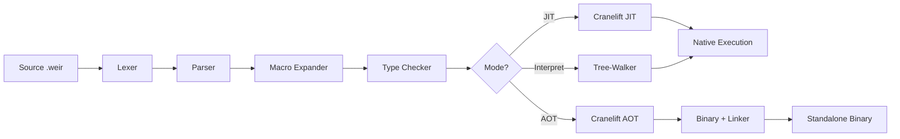
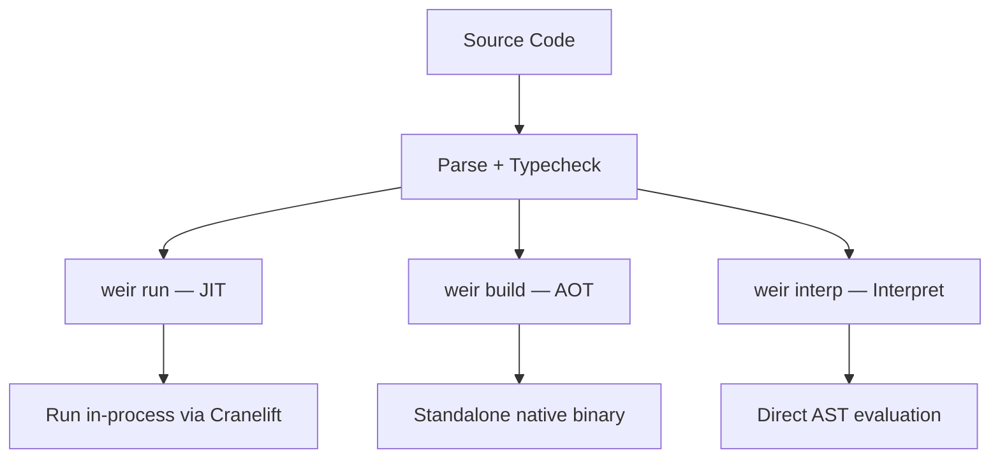

Weir's compilation pipeline transforms source code through several stages, from text to native machine code. The pipeline is strictly linear — each stage has clear inputs and outputs.

## Pipeline Overview



## Stage Details

### 1. Lexer (`weir-lexer`)

Tokenizes source text into a stream of tokens: parentheses, brackets, braces, atoms (identifiers, numbers, strings, keywords), and comments.

### 2. Parser (`weir-parser`)

Transforms the token stream into an AST (abstract syntax tree). The parser recognizes:

- Top-level items: `defn`, `deftype`, `defstruct`, `defclass`, `instance`, `defmacro`, `extern "C"`, `import`
- Expressions: literals, function calls, `let`, `if`, `cond`, `match`, `when`, `unless`, `fn`, `do`, `set!`, `unsafe`
- Patterns: constructor patterns, struct destructuring, wildcards, literals
- Type expressions: named types, function types, type applications, type variables

### 3. Macro Expander (`weir-macros`)

Expands macro invocations by rewriting S-expressions. Macros are purely syntactic — they transform S-expressions into S-expressions without type knowledge:

```
parse → macro expand → type check → compile
```

This keeps the cascade model clean: re-expansion feeds into re-typechecking, which feeds into recompilation.

### 4. Type Checker (`weir-typeck`)

Performs static type checking with:

- **Local type inference** — explicit function signatures, inferred locals
- **Algebraic data type checking** — constructors, exhaustive pattern matching
- **Typeclass resolution** — instance lookup, constraint checking
- **Struct field validation** — construction arguments, field access types
- **Unsafe enforcement** — extern function calls require `unsafe` blocks

The type checker produces a `TypeCheckResult` containing resolved types for every expression, which is consumed by codegen.

### 5a. Cranelift JIT (`weir-codegen`)

For `weir run` and `weir dev`. Compiles each function to native code using Cranelift:

1. Translate typed AST to Cranelift IR (intermediate representation)
2. Cranelift optimizes and generates machine code
3. Code is loaded into executable memory
4. Functions are dispatched via an indirect function table

Cranelift prioritizes compilation speed over maximum optimization — ideal for dev-mode live reloading.

### 5b. Cranelift AOT (`weir-codegen`)

For `weir build`. Compiles the entire program ahead-of-time:

1. Generate Cranelift IR for all functions
2. Emit object file (`.o`)
3. Link with the C runtime and any native libraries via `cc`
4. Produce a standalone binary

### 5c. Interpreter (`weir-interp`)

For `weir interp`. A tree-walking interpreter that evaluates the AST directly. Slower but useful for debugging and testing.

## Three Execution Modes



| Mode | Command | Speed | Use Case |
|---|---|---|---|
| JIT | `weir run` | Fast compile, fast run | Development, testing |
| AOT | `weir build` | Slow compile, fastest run | Release binaries |
| Interpreter | `weir interp` | No compile, slow run | Debugging, testing |
| Dev | `weir dev` | JIT + file watching | Live reloading |

## Implementation

The compiler is implemented in Rust across several crates:

| Crate | Role |
|---|---|
| `weir-lexer` | Tokenizer |
| `weir-parser` | S-expression parser → AST |
| `weir-ast` | AST types, pretty printer, TCO analysis |
| `weir-macros` | Macro expander |
| `weir-typeck` | Type checker |
| `weir-codegen` | Cranelift JIT/AOT backend, dev mode |
| `weir-interp` | Tree-walking interpreter |
| `weir-runtime` | GC, arenas, runtime support |

## Tail-Call Optimization

Self-recursive calls in tail position are compiled as loops in the Cranelift backend and trampolined in the interpreter. This means deep recursion (1M+ depth) works without stack overflow.

A tail-position analysis pass (`weir-ast/src/tco.rs`) identifies which call expressions can be optimized. The codegen transforms these into jumps to a loop header block rather than actual function calls.
