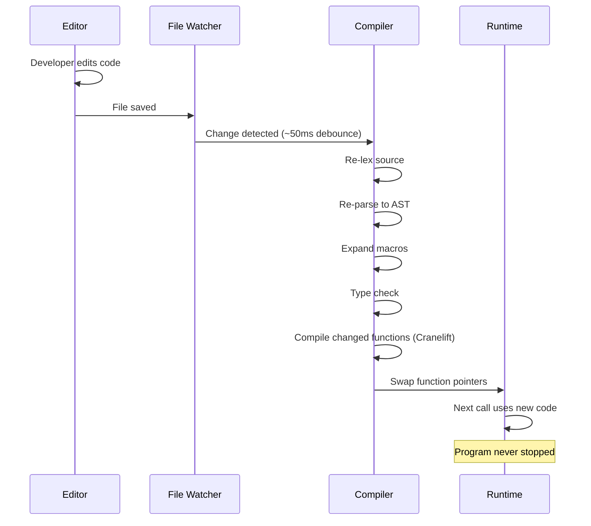
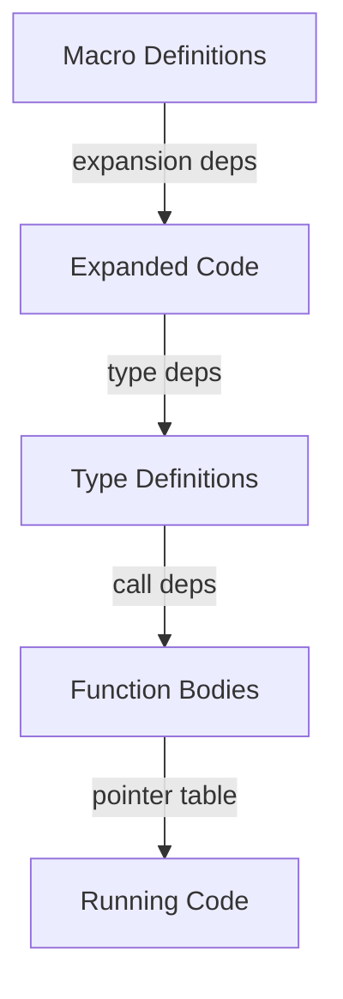
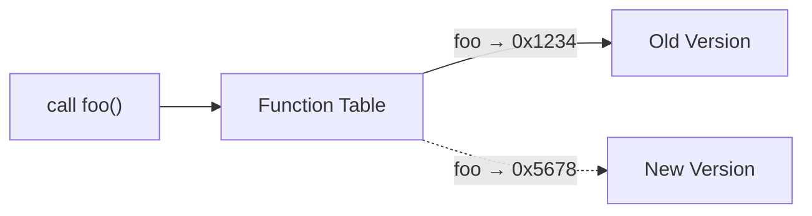

Weir's dev mode (`weir dev`) watches source files and hot-swaps functions while the program is running — no restart needed. This is the core developer experience for game development with Weir.

## How It Works



## The Cascade Model

Different kinds of changes trigger different cascades:

| What Changed | What Happens |
|---|---|
| **Function body** (same signature) | Recompile that function only, swap pointer |
| **Function signature** | Re-typecheck + recompile all callers |
| **Type definition** | Recompile all functions using the type + soft restart for live instances |
| **Macro definition** | Re-expand all call sites → may change types/signatures → cascades further |

### Dependency Tracking

The runtime tracks relationships across three layers:



- **Expansion dependencies**: which code was produced by which macro
- **Type dependencies**: which functions use which types
- **Call dependencies**: which functions call which functions

### Short-Circuit Optimization

When re-expanding a macro call produces the same output as before, the downstream cascade is skipped entirely. The dependency tracker compares expansion outputs structurally. This is critical for performance — most macro redefinitions don't change most expansions.

## Error Behavior

A failed cascade is a build error, not a crash:

- The running program keeps using the **last-known-good** code
- Errors are reported to the developer (terminal output)
- The game keeps running — a build error doesn't kill the process
- Fix the error and save again — the system picks up the correction

## Function Table

All function calls go through an indirect function table — a table of function pointers. Swapping a function means updating one pointer:



The overhead is one extra pointer dereference per call — negligible in practice (SBCL uses the same approach and is fast).

## Type Redefinition

When a type is redefined and live instances exist with the old layout:

1. All dependent functions are re-typechecked and recompiled
2. Pattern match exhaustiveness is re-checked
3. The runtime reports: "type X was redefined, N live instances need reinitialization"
4. The developer triggers a state reset (reload level, respawn entities, etc.)
5. The game loop keeps running with fresh state

The system **never silently runs with stale data**.

## Reload Interface

**Primary: File system watching.** ~50ms debounce catches multi-file writes. When a change is detected, the entire source is re-processed.

**Future: LSP protocol.** The editor will communicate changes directly to the runtime via LSP. A workspace-wide rename would be processed as a single batch/cascade.

**Queue behavior:** If a new change arrives during a cascade, it's queued. The current cascade finishes, then a new cascade runs. No cancellation of in-progress work.

## Using Dev Mode

```bash
# Single file
weir dev game.weir

# Package mode
cd demos/tetris && weir dev
```

While running, edit the source file in your editor. On save, functions are hot-swapped. For the Tetris demo, you can change game logic, rendering, or scoring while the game is running.

## Prior Art

| System | Model | Comparison |
|---|---|---|
| **Erlang/BEAM** | Hot code loading | Closest to Weir's approach — function-level replacement, no persistent image |
| **SBCL** (Common Lisp) | Image + REPL | More powerful (full image persistence) but more complex |
| **Figwheel** (ClojureScript) | Hot reload | Similar DX, but targets the browser |
| **Julia** | JIT + REPL | Similar vibe, starts from source, JIT-based |
