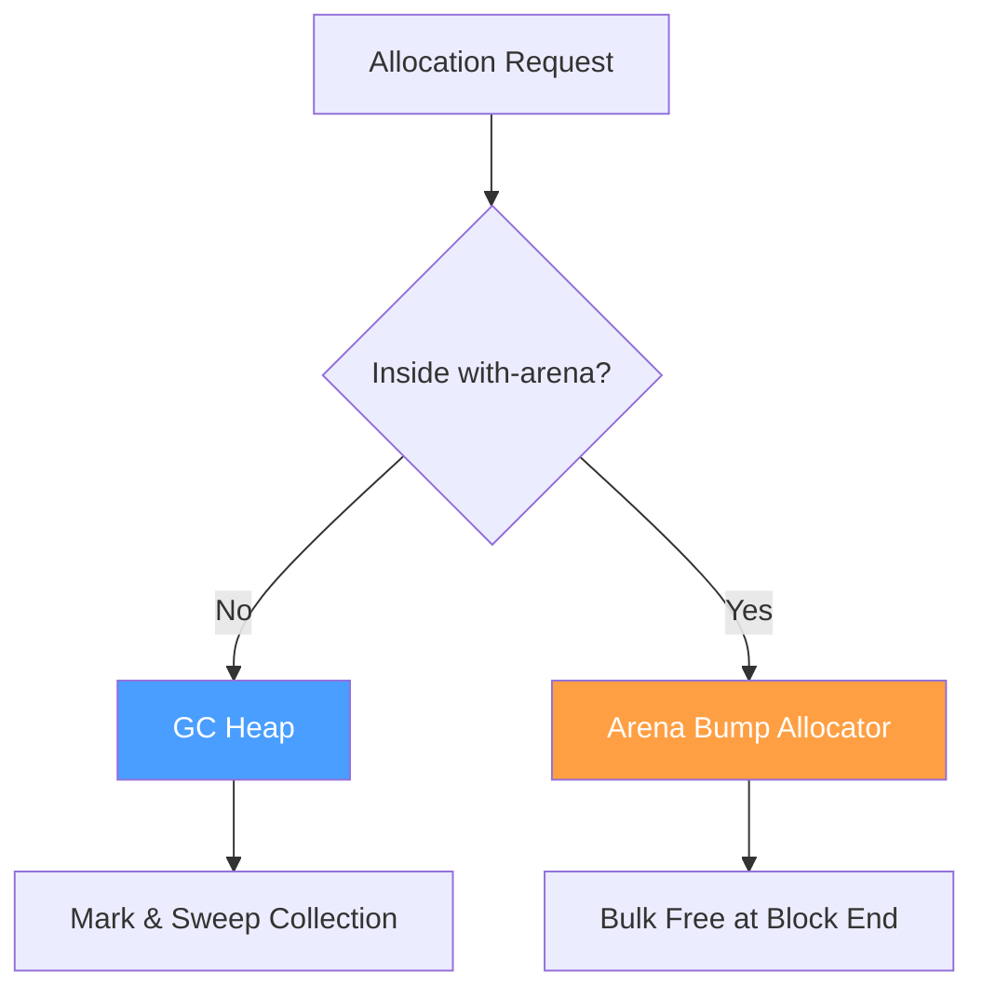
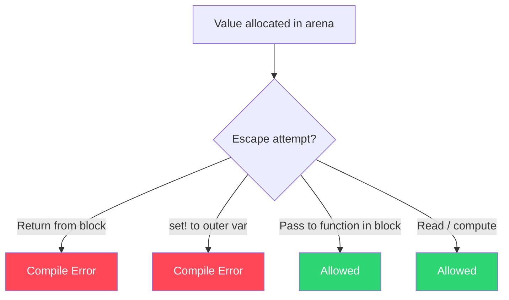

Weir uses a hybrid memory model: tracing garbage collection for most code, with opt-in arena allocation for performance-critical paths.

## Overview



## Tracing GC (Default)

Most code allocates freely with no memory management burden — preserving the Lisp feel. The GC is designed for game development from the start.

```lisp
;; Normal code — GC managed, no memory thinking
(defn load-level ((path : String)) : Level
  (let ((data (read-file path))
        (entities (parse-entities data)))
    (Level entities)))
```

### GC Design

The current implementation uses **mark-and-sweep, stop-the-world** collection. Future improvements planned:

| Feature | Status | Purpose |
|---|---|---|
| Mark-and-sweep | Implemented | Basic tracing collection |
| Shadow stack | Implemented | Root discovery for JIT-compiled code |
| Incremental/concurrent | Future | Reduce pause times |
| Generational | Future | Optimize for short-lived allocations |
| Suppressible | Future | Prevent GC during critical sections |
| Manually triggerable | Future | Full GC during loading screens |
| Game loop aware | Future | Collect between frames |

### How GC Roots Work

The JIT codegen uses a **shadow stack** to track GC roots. At function entry and `let` bindings, heap-pointer values are stored into dedicated stack slots whose addresses are pushed onto the shadow stack. The GC reads these slot addresses to find live objects.

## Arena Allocation (Opt-in)

For performance-critical code, the developer explicitly opts into arena allocation via `with-arena` blocks. Arenas use **bump allocation** (a pointer increment — near-zero cost) and free all contents at once when the block ends.

```lisp
;; Hot path — arena allocated, no GC pauses
(defn update-physics ((world : World)) : Unit
  (with-arena frame
    (let ((contacts (detect-collisions world))
          (impulses (solve-constraints contacts)))
      (apply-impulses world impulses))))
;; everything allocated in the arena is freed instantly at block end
```

### Arena Escape Prevention

:::danger
Claude insists arena allocations cannot escape, but I am highly skeptical of this. My understanding is that truly solving
arena escapes is a halting problem-problem. This feature was intentionally designed to allow for more efficient hotpaths, albeit with some danger.
:::

Arena-allocated values cannot escape their `with-arena` block. The compiler enforces this via **lexical escape analysis**:



This is a purely syntactic check — not a full lifetime system like Rust:

- **Cannot** return an arena-allocated value from the `with-arena` block
- **Cannot** assign an arena value to an outer mutable variable via `set!`
- **Can** pass arena values to functions called within the block
- **Can** read from arena values and use them in computations

### Why It Works Without Lifetimes

Several permanent design properties of Weir make the lexical analysis sufficient:

- **No mutable references** — function arguments are passed by value (copying the pointer). The callee cannot modify the caller's bindings.
- **No global mutable state** — no top-level mutable variables to stash arena pointers in.
- **Conservative call tagging** — any function call returning a heap type inside an arena block gets arena provenance, preventing escape even if it allocated from the GC.

## Hybrid Model Benefits

| Concern | How Addressed |
|---|---|
| Lisp feel | GC by default — 90%+ of code just allocates freely |
| Game dev performance | Arenas for hot paths — zero GC pauses where it matters |
| Safety | GC prevents use-after-free; arena escapes caught at compile time |
| Live reloading | GC handles stale instances naturally; arenas are transient and unaffected |
| Guard rails | Safe by default (GC), explicit opt-in for performance (arenas) |

## Interaction with Types

The type system tracks arena provenance to enforce escape prevention:

- Arena-scoped values carry implicit provenance annotations (no developer-visible region types)
- Generic functions work over both GC and arena-allocated values transparently
- A closure that captures an arena value must itself be arena-scoped

## Object Layout

Heap objects (structs, closures, ADT payloads, vectors) are GC-managed:

- Allocated via `weir_gc_alloc(shape, size)`
- Fields stored as consecutive `i64` slots (uniform slot size)
- Each object has a `ShapeDesc` with a `pointer_mask` marking which slots contain heap pointers
- The GC traces through pointer slots to find live references
