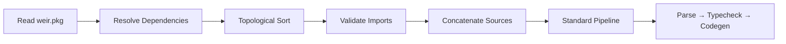
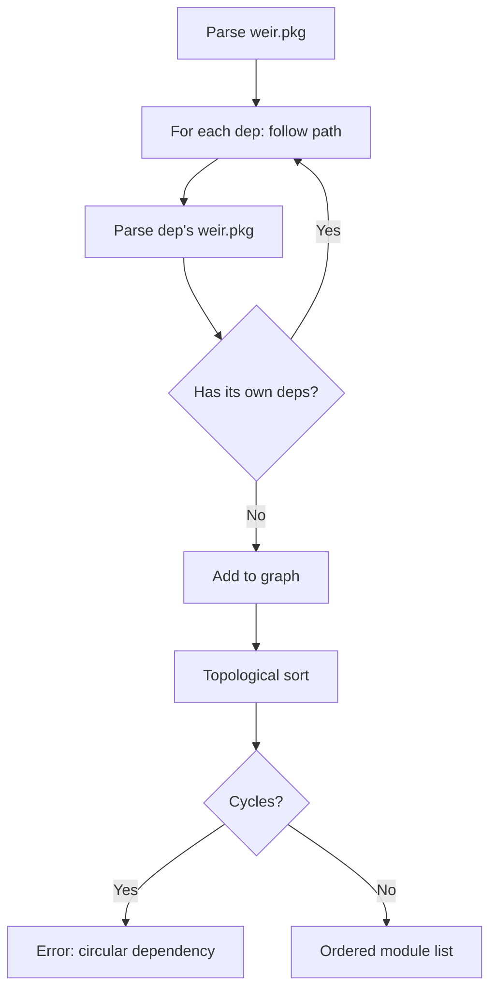

Weir's package system lets you organize multi-file, multi-package projects using `weir.pkg` manifest files with S-expression syntax.

## Overview



## Manifest Format

Package metadata lives in a `weir.pkg` file at the package root. The format is S-expressions — dogfooding the language syntax.

### Library Package

```lisp
;; weir-gl/weir.pkg
(package
  (name "weir-gl")
  (version "0.1.0")

  (sources "lib.weir")

  (native
    (sources "gl_helper.c")
    (link "glfw" "GL" "m")))
```

### Application Package

```lisp
;; demos/tetris/weir.pkg
(package
  (name "tetris-gl")
  (version "0.1.0")

  (deps
    (weir-gl (path "../../../weir-gl")))

  (main "tetris.weir"))
```

### Fields

| Field | Required | Description |
|---|---|---|
| `name` | Yes | Package name (string). Becomes the root module name for imports. |
| `version` | Yes | Semver string (informational for now). |
| `sources` | No | Source files — string or list of strings. Paths relative to `weir.pkg`. |
| `main` | No | Entry point file (has `defn main`). For applications only. |
| `deps` | No | Dependencies. Each is `(name (path "relative/or/absolute"))`. |
| `native` | No | Native C code. `sources` = C files, `link` = libraries (`-l` flags). |

## Module Naming

File paths within a package determine module names:

| Package | Source File | Module Name |
|---|---|---|
| `weir-gl` | `lib.weir` | `weir-gl` |
| `foo` | `bar.weir` | `foo.bar` |
| `foo` | `lib.weir` | `foo` |
| `foo` | `utils.weir` | `foo.utils` |

**Convention:** `lib.weir` maps to the bare package name — it's the package's root module and default entry point for imports.

## Imports

Modules import from each other using the `import` form:

```lisp
;; Import specific symbols
(import weir-gl (gl_init gl_should_close gl_begin_frame gl_end_frame))

;; Import with alias (planned)
(import math.vec2 :as v)

;; Import everything (discouraged)
(import math.vec2 :all)
```

Import validation checks that:
- The referenced module exists in a resolved dependency
- The imported symbols actually exist in the module's exports

## Dependency Resolution



Dependencies are **local path-based only** — no registry, no git URLs, no lock files. Packages live on the developer's local machine.

## Native Code

Packages can include native C source files that are automatically compiled:

- **JIT mode** (`weir run`): C sources are compiled into a shared library (`.so`) and `dlopen`ed before JIT execution
- **AOT mode** (`weir build`): C sources are passed to the system linker via `--cc-arg`

```lisp
(native
  (sources "gl_helper.c" "audio.c")
  (link "glfw" "GL" "m" "openal"))
```

## CLI Integration

When `run`, `build`, or `dev` are invoked without a file argument, the CLI discovers `weir.pkg` in the current directory:

```bash
cd demos/tetris
weir run                    # JIT via weir.pkg
weir build -o ../../tmp/t   # AOT via weir.pkg
weir dev                    # dev mode via weir.pkg
```

Single-file mode still works when a file arg is provided:

```bash
weir run hello.weir         # no weir.pkg needed
```

## Example: Tetris

The OpenGL Tetris demo is structured as a two-package project:

```
weir-gl/                    # Library package (external)
  weir.pkg                  # name: "weir-gl"
  lib.weir                  # extern "C" declarations
  gl_helper.c              # Native OpenGL/GLFW wrappers

demos/tetris/              # Application package
  weir.pkg                 # name: "tetris-gl", deps: weir-gl
  tetris.weir              # Game code importing weir-gl
```

Build and run:

```bash
cd demos/tetris
weir build -o ../../tmp/tetris_gl   # or: weir run
```

The package system replaces what would otherwise be manual `--cc-arg` and `-l` flags.
