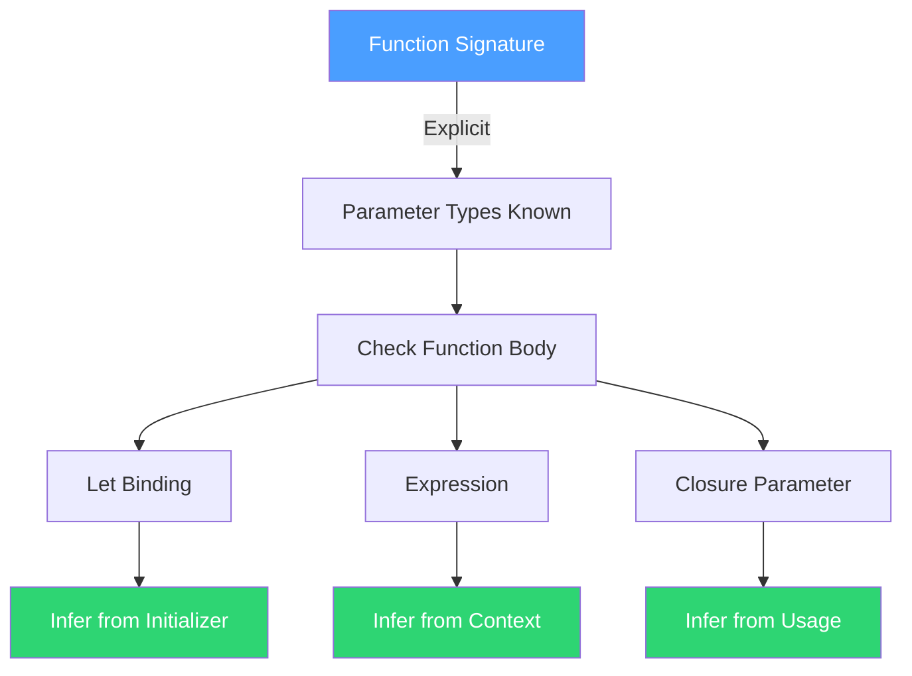
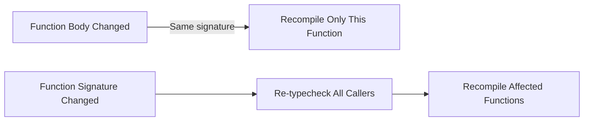

Weir uses **local type inference** — a middle ground between fully explicit types and full Hindley-Milner inference. Function signatures are always explicit; local variable types are inferred.

## Inference Strategy



## What's Always Explicit

Top-level function signatures require parameter types and return type:

```lisp
(defn add ((x : i32) (y : i32)) : i32
  (+ x y))

(defn map ((f : (Fn ['a] 'b)) (xs : (List 'a))) : (List 'b)
  ...)
```

Also always explicit:
- Type definitions (`deftype`, `defstruct`)
- Typeclass instance declarations

## What's Inferred

### Local Variables

Types of `let` bindings are inferred from their initializer:

```lisp
(defn example ((x : i64)) : i64
  (let ((y (+ x 1))           ;; y : i64 — inferred from (+ x 1)
        (name "hello")         ;; name : String — inferred from literal
        (flag (> x 0)))        ;; flag : Bool — inferred from comparison
    (if flag y 0)))
```

### Closure Parameters

When a closure is used in a context that determines its type, parameter types are inferred:

```lisp
(defn apply-to-list ((xs : (List i64))) : (List i64)
  (map (fn (x) (+ x 1)) xs))
  ;;        ^ x : i64 — inferred from (List i64) context
```

### Intermediate Expressions

All expression types are inferred from their components:

```lisp
(defn calc ((a : f64) (b : f64)) : f64
  (let ((sum (+ a b))           ;; f64 — from a + b
        (diff (- a b))          ;; f64 — from a - b
        (product (* sum diff))) ;; f64 — from sum * diff
    (sqrt product)))            ;; f64 — sqrt returns f64
```

## Why Local Inference

### Self-Documenting Functions

You can read a function's signature without running inference in your head:

```lisp
;; Clear from the signature: takes two Vec2s, returns f64
(defn distance ((a : Vec2) (b : Vec2)) : f64
  ...)
```

### Localized Error Messages

A type mistake inside function A can't produce a confusing error in function B. Errors are always reported at the point of the mistake:

```lisp
(defn foo ((x : i32)) : i32
  (+ x "hello"))     ;; Error HERE: can't add i32 and String
```

### Live Reloading Benefits

Explicit signatures enable clean dependency tracking:

- The dependency tracker instantly detects signature changes by comparing declarations
- Body-only changes never cascade to callers
- Signature changes are intentional and visible



### IDE Support

The LSP can show inferred types for locals inline, giving the benefits of inference where it's useful:

```lisp
(let ((x 42))           ;; LSP shows: x : i64
     ((name "Alice"))   ;; LSP shows: name : String
  ...)
```

## Type Annotation (`ann`)

When inference picks the wrong type (e.g., for numeric literals), use `ann` to constrain:

```lisp
(ann i32 42)                  ;; force i32 instead of default i64
(ann f32 3.14)                ;; force f32 instead of default f64
(ann (List Enemy) (filter alive? entities))  ;; pin polymorphic return
```

`ann` is a constraint, not a cast. If the expression can't have the asserted type, it's a compile error.

## Generics

Generic functions use type variables in their signatures:

```lisp
(defn identity ((x : 'a)) : 'a
  x)

(defn first ((pair : (Pair 'a 'b))) : 'a
  (.fst pair))
```

Implementation differs by mode:
- **Dev mode**: type erasure — one compiled version, boxed values (faster compilation)
- **Release mode**: monomorphization — specialized version per concrete type (zero overhead)

Behavioral semantics are identical in both modes.
