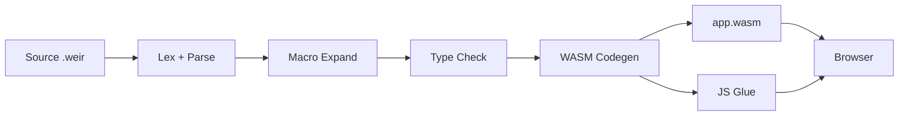

Weir can compile programs to WebAssembly (WASM), allowing them to run in web browsers. The WASM backend produces a complete deployment package — `.wasm` binary, JavaScript runtime bridge, and HTML — ready to serve.

## Building for WASM

Use the `wasm` subcommand to compile a Weir project:

```bash
# From a package directory (with weir.pkg)
weir wasm

# Single-file mode
weir wasm game.weir -o web/
```

This produces a `web/` directory containing:

| File | Purpose |
|---|---|
| `app.wasm` | Compiled WebAssembly binary |
| `runtime.js` | JS bridge providing print, time, math imports |
| `loader.js` | Entry point — instantiates WASM and starts the program |
| `index.html` | Minimal HTML shell with canvas and output elements |

If the project uses a GL bridge (like `weir-opengl`), `gl_bridge.js` is also included.

## Serving

WASM modules require an HTTP server (ES modules don't work over `file://`):

```bash
cd web && python3 -m http.server 8000
# Open http://localhost:8000
```

## How It Works

The WASM compiler (`weir-wasm`) takes the same parsed and type-checked AST as the native backend, but emits WebAssembly bytecode instead of Cranelift IR.



### Runtime Architecture

The WASM module imports functions from JavaScript and exports `weir_main` (and optionally `weir_frame` for animation loops):

**JS imports (provided by `runtime.js`):**
- Printing: `weir_print_i64`, `weir_print_f64`, `weir_print_str`, `weir_print_bool`, `weir_print_newline`
- Time: `weir_time_ms`, `weir_sleep_ms`
- Math: `sin`, `cos`, `sqrt`, `pow`, etc. (from `Math` object)

**Internal WASM functions (compiled into the binary):**
- Memory: bump allocator (`weir_gc_alloc`), string allocation
- Vectors: `weir_vec_get`, `weir_vec_set`, `weir_vec_len`, `weir_vec_append`, `weir_vec_set_nth`
- Strings: `weir_str_eq`, `weir_str_concat`, `weir_string_length`, `weir_i64_to_str`, `weir_f64_to_str`, `weir_bool_to_str`, `weir_substring`, `weir_string_contains`
- RNG: `weir_random_seed`, `weir_random_int` (xorshift64)

### Memory Model

WASM uses 32-bit linear memory with a simple bump allocator:

| Region | Address Range | Purpose |
|---|---|---|
| Null guard | `0x0000 - 0x0FFF` | Trap on null pointer access |
| Static data | `0x1000 - 0xFFFF` | Interned string literals |
| Shadow stack | `0x10000 - 0x1FFFF` | RNG state, scratch space |
| GC heap | `0x20000+` | Bump-allocated objects |

The initial memory is 16 MB (256 pages), expandable to 4 GB.

## Platform-Conditional Code

Use `(target ...)` to write code that differs between native and WASM:

```lisp
(target
  (:native
    (defn game-loop ((state : GameState)) : Unit
      ;; Native: recursive loop with gl_should_close check
      (if (= (unsafe (gl_should_close)) 1)
        (unsafe (gl_cleanup))
        (do (unsafe (gl_begin_frame))
            (let ((s (update state)))
              (render s)
              (unsafe (gl_end_frame))
              (game-loop s))))))
  (:wasm
    (defn weir-frame () : Unit
      ;; WASM: single-frame function called by requestAnimationFrame
      (let ((state (wasm-get-state)))
        (unsafe (gl_begin_frame))
        (let ((s (update state)))
          (render s)
          (unsafe (gl_end_frame))
          (wasm-set-state s))))))
```

The macro expander resolves `(target ...)` at compile time — only the matching branch is included.

### WASM State Management

Since WASM frame functions are called externally by `requestAnimationFrame`, persistent state uses a global pointer:

```lisp
;; Store state pointer in WASM global
(wasm-set-state (init-state))

;; Retrieve it each frame
(let ((state (wasm-get-state)))
  ...)
```

## GL Bridge

For graphical applications, the `weir-opengl` package provides a WebGL 2 bridge (`gl_bridge.js`) that implements the same API as the native C helper:

- `gl_init` / `gl_cleanup` — window/canvas setup
- `gl_draw_rect` — batched quad rendering
- `gl_draw_text` — bitmap font rendering (8x8 CP437)
- `gl_get_key` / `gl_get_key_pressed` — keyboard input with edge detection
- `gl_time_ms` — high-resolution timer via `performance.now()`

GLFW key codes are automatically translated to browser key codes.

## Live Demo

The Tetris demo is compiled to WASM and playable in the browser:

**[Play Tetris in WebAssembly](/tetris)**

## Limitations

- **No GC** — the bump allocator never frees memory. Long-running apps will eventually exhaust the 16 MB heap. A tracing GC is planned.
- **No closures** — lambda expressions compile to stub pointers. First-class functions are not yet supported in the WASM backend.
- **No file I/O** — `weir_read_file` and `weir_write_file` are stubs in the browser.
- **No threads** — WASM runs single-threaded. The concurrency primitives (`spawn`, `with-tasks`) are not available.
